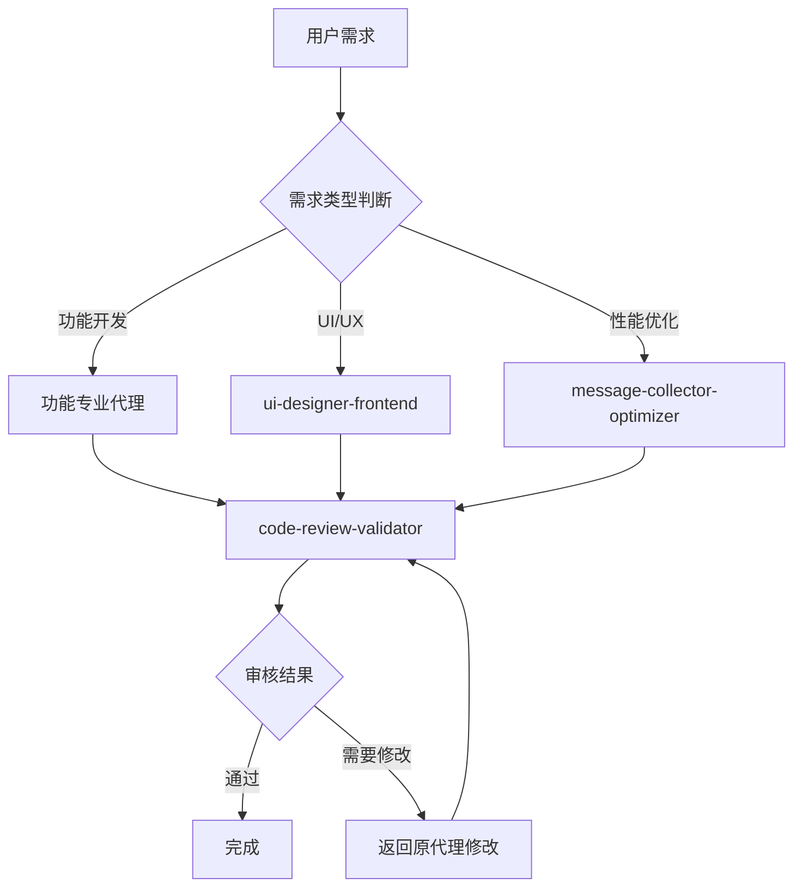

# Claude Code 代理协作配置

## 🤖 三代理协作体系

本项目配置了三个专业化代理，形成完整的开发-优化-审核闭环：

### 代理分工

| 代理 | 职责 | 触发时机 | 协作关系 |
|------|------|----------|----------|
| **code-review-validator** | 代码质量保证 | 功能完成、Bug修复后 | 审核其他代理的输出 |
| **ui-designer-frontend** | 前端界面开发 | UI/UX相关需求 | 被审核代理审查 |
| **message-collector-optimizer** | 消息处理优化 | 性能、算法优化需求 | 被审核代理审查 |

## 🔄 智能协作流程

### 1. 自动触发机制

#### 代码审核代理 (code-review-validator)
**触发条件**:
- ✅ 任何代理完成代码修改后自动触发
- ✅ 用户明确要求代码审核时
- ✅ 发现潜在问题需要验证时

**触发关键词**:
- "完成了...功能"
- "修复了...问题" 
- "优化了...性能"
- "更新了...逻辑"
- "实现了...需求"

#### UI设计代理 (ui-designer-frontend)
**触发条件**:
- 🎨 涉及前端界面的设计或修改
- 🎨 用户体验优化需求
- 🎨 页面布局或样式问题
- 🎨 数据展示不正确

**触发关键词**:
- "界面", "页面", "前端", "UI", "样式"
- "显示不正确", "布局问题", "响应式"
- "用户体验", "交互", "可视化"

#### 消息优化代理 (message-collector-optimizer)
**触发条件**:
- ⚡ 消息处理性能问题
- ⚡ 广告过滤不准确
- ⚡ 去重功能失效
- ⚡ 内容过滤逻辑问题

**触发关键词**:
- "广告", "过滤", "去重", "采集"
- "性能", "优化", "慢", "效率"
- "误判", "漏过", "重复"

### 2. 协作工作流



### 3. 协作规则

#### 主代理职责
- 🎯 **需求分析**: 理解用户需求，选择合适的专业代理
- 🎯 **任务分发**: 将复杂任务拆分给专业代理
- 🎯 **结果整合**: 汇总各代理的输出，提供统一响应

#### 专业代理职责
- 🔧 **专业实现**: 在自己的专业领域内高质量完成任务
- 🔧 **主动通知**: 完成工作后主动触发审核代理
- 🔧 **反馈改进**: 根据审核结果进行必要的修改

#### 审核代理职责
- ✅ **质量把关**: 对所有代码修改进行严格审查
- ✅ **问题识别**: 发现潜在的bug、性能问题、安全隐患
- ✅ **改进建议**: 提供具体的改进建议和解决方案

## 🧠 智能判断逻辑

### 代理选择算法
```python
def select_agent(user_request):
    keywords = extract_keywords(user_request)
    
    # UI相关优先级最高
    if any(word in keywords for word in ['界面', '页面', 'UI', '样式', '布局']):
        return 'ui-designer-frontend'
    
    # 性能优化相关
    elif any(word in keywords for word in ['优化', '性能', '过滤', '去重', '广告']):
        return 'message-collector-optimizer'
    
    # 代码审核相关
    elif any(word in keywords for word in ['审核', '检查', '验证', '测试']):
        return 'code-review-validator'
    
    # 复杂需求，主代理处理
    else:
        return 'general-purpose'
```

### 协作触发条件
```python
def should_trigger_review(action_completed):
    """判断是否需要触发代码审核"""
    trigger_conditions = [
        'file_modified',
        'new_feature_completed', 
        'bug_fixed',
        'performance_optimized',
        'ui_updated'
    ]
    return action_completed in trigger_conditions

def should_collaborate(current_agent, task_type):
    """判断是否需要多代理协作"""
    collaboration_matrix = {
        'ui-designer-frontend': ['code-review-validator'],
        'message-collector-optimizer': ['code-review-validator'],
        'code-review-validator': []  # 审核代理不需要被审核
    }
    return collaboration_matrix.get(current_agent, [])
```

## 📋 最佳实践

### 1. 代理调用范例
```python
# 示例1: UI相关问题
user: "页面上的消息显示不正确，时间格式也有问题"
# => 自动调用 ui-designer-frontend
# => 完成后自动调用 code-review-validator 审核

# 示例2: 性能优化
user: "去重功能好像没有发挥作用，请优化"
# => 自动调用 message-collector-optimizer  
# => 完成后自动调用 code-review-validator 审核

# 示例3: 代码审查
user: "刚完成了用户认证功能，请检查代码"
# => 直接调用 code-review-validator
```

### 2. 错误处理机制
- **代理失败回退**: 如果专业代理失败，回退到主代理处理
- **审核不通过处理**: 审核代理发现问题时，返回原代理修改
- **循环审核保护**: 避免代理间无限循环调用

### 3. 性能优化
- **缓存代理结果**: 相似任务复用之前的代理结果
- **并行处理**: 非依赖性任务可以并行调用多个代理
- **资源限制**: 控制代理调用频率，避免资源过度消耗

## 🎯 协作目标

通过智能的代理协作机制，实现：

1. **提升代码质量**: 每个修改都经过专业审核
2. **提高开发效率**: 专业分工，各司其职
3. **减少错误率**: 多重检查，降低bug风险
4. **优化用户体验**: 专业的UI代理保证界面质量
5. **持续优化**: 专业的优化代理保证系统性能

每个代理都是团队中不可或缺的专业角色，通过协作共同为项目的成功贡献力量。