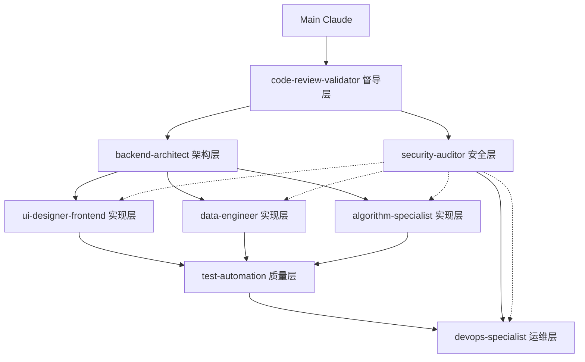

# Claude Code 代理协作配置

## 🤖 八代理专业体系

本项目配置了八个专业化代理，形成完整的软件开发生命周期覆盖：

### 代理分工

| 代理 | 职责 | 模型 | 触发时机 | 协作关系 |
|------|------|------|----------|----------|
| **backend-architect** 🏗️ | 系统架构设计 | Opus | 架构设计、API设计、技术选型 | 指导其他开发代理 |
| **ui-designer-frontend** 🎨 | 前端界面开发 | Sonnet | UI/UX需求、界面优化 | 被架构代理指导 |
| **data-engineer** 📊 | 数据处理优化 | Sonnet | 数据库优化、ETL处理 | 与架构代理协作 |
| **algorithm-specialist** 🤖 | 算法和AI优化 | Opus | 算法优化、AI模型改进 | 独立专业领域 |
| **test-automation** 🧪 | 测试质量保证 | Sonnet | 测试设计、质量验证 | 验证所有代理输出 |
| **devops-specialist** ⚙️ | 部署运维管理 | Sonnet | 部署、监控、运维 | 支撑所有代理 |
| **security-auditor** 🔒 | 安全审计保护 | Opus | 安全审计、风险评估 | 审查所有安全相关 |
| **code-review-validator** ✅ | 代码审核督导 | Opus | 任何代码完成后 | 最终质量把关 |

## 🔄 代理协调机制设计

### 层级关系



### 协作规则

#### 🎯 职责边界原则
```yaml
# 严格的职责边界定义
boundaries:
  backend-architect:
    owns: ["系统架构", "API设计", "数据库设计", "技术选型"]
    never: ["UI设计", "前端代码", "具体算法实现", "部署配置"]
    
  ui-designer-frontend:
    owns: ["UI界面", "用户体验", "前端架构", "组件设计"]
    never: ["后端逻辑", "数据库设计", "算法实现", "系统架构"]
    
  data-engineer:
    owns: ["数据处理", "ETL", "备份恢复", "数据库优化"]
    never: ["前端界面", "算法模型", "部署配置", "安全策略"]
    
  algorithm-specialist:
    owns: ["算法逻辑", "AI模型", "机器学习", "模式识别"]
    never: ["系统架构", "数据库设计", "UI界面", "部署运维"]
    
  test-automation:
    owns: ["测试策略", "自动化测试", "性能测试", "质量保证"]
    never: ["业务逻辑", "算法设计", "系统架构", "生产部署"]
    
  devops-specialist:
    owns: ["容器化", "CI/CD", "监控", "部署运维"]
    never: ["业务开发", "算法设计", "UI设计", "安全策略"]
    
  security-auditor:
    owns: ["安全审计", "威胁分析", "合规检查", "安全策略"]
    never: ["业务功能", "性能优化", "UI设计", "算法实现"]
    
  code-review-validator:
    owns: ["代码审查", "质量把关", "最佳实践", "架构一致性"]
    never: ["具体实现", "需求分析", "产品设计"]
```

#### 🔄 协作触发机制
```python
class AgentCoordinator:
    def __init__(self):
        self.collaboration_matrix = {
            # 主要协作关系
            'backend-architect': ['ui-designer-frontend', 'data-engineer', 'algorithm-specialist'],
            'ui-designer-frontend': ['test-automation'],
            'data-engineer': ['algorithm-specialist', 'security-auditor'],
            'algorithm-specialist': ['test-automation'],
            'test-automation': ['devops-specialist', 'security-auditor'],
            'devops-specialist': ['security-auditor'],
            'security-auditor': ['all'],  # 安全审查所有代理
            'code-review-validator': ['all']  # 代码审查所有代理的输出
        }
    
    def select_primary_agent(self, task_description):
        """根据任务描述选择主要负责的代理"""
        keywords_map = {
            'backend-architect': ['架构', '设计模式', 'API', '重构', '系统设计', '技术选型'],
            'ui-designer-frontend': ['界面', 'UI', '前端', '用户体验', '组件', '样式', '交互'],
            'data-engineer': ['数据处理', 'ETL', '备份', '数据库优化', '查询优化', '数据迁移'],
            'algorithm-specialist': ['算法', 'AI', '机器学习', '广告检测', '去重', '相似度', '模型'],
            'test-automation': ['测试', '单元测试', '集成测试', '性能测试', '自动化测试'],
            'devops-specialist': ['部署', 'Docker', '监控', '运维', 'CI/CD', '容器化'],
            'security-auditor': ['安全', '权限', '漏洞', '加密', '审计', '合规', '威胁'],
            'code-review-validator': ['审核', '检查', '验证', '代码质量', '最佳实践']
        }
        
        scores = {}
        for agent, keywords in keywords_map.items():
            scores[agent] = sum(1 for keyword in keywords if keyword in task_description)
        
        return max(scores, key=scores.get)
    
    def get_collaborators(self, primary_agent):
        """获取需要协作的代理列表"""
        return self.collaboration_matrix.get(primary_agent, [])
```

#### 🚫 防重叠机制
```python
class BoundaryEnforcer:
    """代理边界执行器"""
    
    def validate_agent_output(self, agent_name, output, task_context):
        """验证代理输出是否超出职责边界"""
        
        # 定义每个代理禁止涉及的领域
        forbidden_areas = {
            'backend-architect': ['CSS样式', '前端组件', 'UI设计', 'Docker配置'],
            'ui-designer-frontend': ['数据库schema', '算法实现', '部署配置', '系统架构'],
            'data-engineer': ['前端样式', '算法逻辑', 'UI交互', '部署脚本'],
            'algorithm-specialist': ['UI界面', '数据库设计', '部署运维', '系统架构'],
            'test-automation': ['业务逻辑实现', '算法设计', '生产部署', '系统架构'],
            'devops-specialist': ['业务功能', 'UI设计', '算法实现', '安全策略'],
            'security-auditor': ['业务功能', 'UI设计', '算法实现', '性能优化']
        }
        
        agent_forbidden = forbidden_areas.get(agent_name, [])
        
        # 检查输出是否涉及禁止领域
        violations = []
        for forbidden in agent_forbidden:
            if forbidden.lower() in output.lower():
                violations.append(forbidden)
        
        if violations:
            return {
                'valid': False,
                'violations': violations,
                'suggestion': f'请让相应的专业代理处理这些内容'
            }
        
        return {'valid': True}
```

### 📋 工作流程

#### 1. 任务分发流程
```
用户需求 → 主代理分析 → 选择主要代理 → 识别协作代理 → 并行/串行执行 → 代码审查 → 输出整合
```

#### 2. 质量保证流程
```
代理输出 → 边界检查 → 技术审查 → 集成测试 → 安全审计 → 最终验收
```

#### 3. 冲突解决机制
- **边界冲突**：由code-review-validator仲裁
- **技术分歧**：由backend-architect做最终决策
- **优先级冲突**：按照用户需求紧急程度排序
- **安全问题**：security-auditor有最高优先级

## 📋 最佳实践

### 1. 代理调用范例
```python
# 示例1: 系统架构问题
user: "系统处理大量消息时出现性能瓶颈，需要重新设计架构"
# => 自动调用 backend-architect
# => 协作调用 data-engineer 和 algorithm-specialist
# => 最终由 code-review-validator 审核

# 示例2: UI界面优化
user: "页面上的消息显示不正确，时间格式也有问题"
# => 自动调用 ui-designer-frontend
# => 协作调用 test-automation 进行测试
# => 最终由 code-review-validator 审核

# 示例3: 算法优化
user: "广告检测准确率不够，需要优化算法"
# => 自动调用 algorithm-specialist
# => 协作调用 test-automation 进行验证
# => 最终由 code-review-validator 审核

# 示例4: 安全问题
user: "需要检查系统的安全漏洞并加强权限控制"
# => 自动调用 security-auditor
# => 协作调用 devops-specialist 实施加固
# => 最终由 code-review-validator 审核

# 示例5: 部署问题
user: "需要优化Docker部署配置，提高启动速度"
# => 自动调用 devops-specialist
# => 协作调用 security-auditor 检查安全配置
# => 最终由 code-review-validator 审核
```

### 2. 错误处理机制
- **代理失败回退**: 如果专业代理失败，回退到主代理处理
- **审核不通过处理**: 审核代理发现问题时，返回原代理修改
- **循环审核保护**: 避免代理间无限循环调用
- **冲突仲裁机制**: backend-architect 作为技术仲裁者
- **紧急降级**: 关键路径支持紧急降级到单代理模式
- **状态恢复**: 支持代理协作状态的保存和恢复

### 3. 性能优化
- **缓存代理结果**: 相似任务复用之前的代理结果
- **并行处理**: 非依赖性任务可以并行调用多个代理
- **资源限制**: 控制代理调用频率，避免资源过度消耗
- **智能路由**: 根据任务复杂度选择合适的模型（Opus vs Sonnet）
- **上下文共享**: 代理间共享项目上下文，避免重复分析

## 🎯 协作目标

通过智能的八代理协作机制，实现：

### 技术目标
1. **架构先进性**: backend-architect 确保系统架构的前瞻性和扩展性
2. **代码高质量**: code-review-validator 保证每个修改都经过专业审核
3. **算法智能化**: algorithm-specialist 持续优化AI算法和智能处理
4. **数据可靠性**: data-engineer 确保数据处理的效率和安全性
5. **界面专业化**: ui-designer-frontend 保证用户体验的专业性
6. **测试全面性**: test-automation 确保系统质量和稳定性
7. **运维自动化**: devops-specialist 实现高效的部署和运维
8. **安全可靠性**: security-auditor 保障系统的全面安全防护

### 业务目标
1. **开发效率提升**: 专业分工，各司其职，避免技能浪费
2. **质量保证增强**: 多层次审查机制，降低bug风险
3. **技术债务控制**: 持续的代码审查和架构优化
4. **创新能力增强**: 专业代理推动技术创新和最佳实践
5. **团队能力放大**: 每个代理都具备特定领域的专家能力

### 管理目标
1. **风险管控**: 通过专业审查降低技术和安全风险
2. **知识沉淀**: 代理经验的积累和复用
3. **标准化流程**: 建立标准化的开发和审查流程
4. **持续改进**: 基于反馈的持续优化机制

每个代理都是这个Telegram消息处理系统中不可或缺的专业角色，通过智能协作共同构建世界级的技术产品。

## 🚀 代理协作的价值

这套八代理体系不仅仅是技术工具，更是：

1. **专业化团队**: 每个代理都具备特定领域的深度专业知识
2. **质量保证系统**: 多重检查确保最高的代码和系统质量
3. **创新驱动引擎**: 专业代理推动技术创新和最佳实践应用
4. **风险控制机制**: 通过专业审查和安全检查降低项目风险
5. **效率倍增器**: 专业分工和智能协作大幅提升开发效率

通过这套代理体系，我们不仅解决了当前的技术挑战，更为未来的技术演进奠定了坚实的基础。