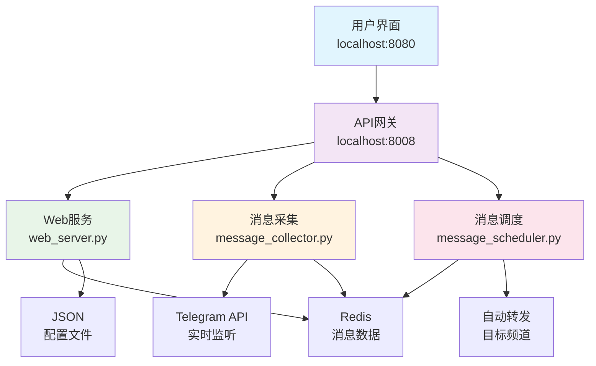

# 🤖 Telegram消息采集审核系统

一个现代化的Telegram频道消息采集、智能过滤和自动化转发系统。通过AI驱动的内容过滤和人工审核流程，实现高质量内容的自动化筛选和分发。

[](https://python.org)
[](https://fastapi.tiangolo.com)
[](https://vuejs.org)
[](https://redis.io)

## ✨ 核心特性

### 🔄 智能消息处理
- **实时监听**：多频道同时监听，毫秒级消息捕获
- **智能过滤**：AI驱动的广告检测、关键词过滤、内容清理
- **批量处理**：支持历史消息批量采集和处理
- **媒体支持**：图片、视频、文档等多媒体内容完整保留

### 🎯 高效审核流程
- **可视化审核**：直观的Web界面，支持消息预览和批量操作
- **智能分类**：自动识别广告、推广、垃圾内容
- **审核队列**：支持多人协作审核，状态实时同步
- **一键操作**：批量审批、拒绝、删除等快捷操作

### 🚀 自动化转发
- **规则引擎**：灵活的转发规则配置
- **定时发布**：支持延迟发布和定时转发
- **格式优化**：自动清理冗余信息，保持内容简洁
- **失败重试**：智能重试机制，确保消息可靠投递

### 🎛️ 管理控制台
- **实时监控**：系统状态、消息统计、性能指标
- **配置管理**：频道配置、过滤规则、系统参数
- **用户管理**：管理员权限控制和操作日志
- **数据分析**：详细的统计报表和趋势分析

## 🚀 快速开始

### 环境要求

- **Python**: 3.11+
- **Redis**: 5.0+
- **系统**: Linux/macOS/Windows
- **内存**: 建议2GB+

### 安装部署

1. **克隆项目**
```bash
git clone https://github.com/your-repo/telegram_channel_bot.git
cd telegram_channel_bot
```

2. **安装依赖**
```bash
# 创建虚拟环境
python3 -m venv venv
source venv/bin/activate  # Linux/macOS
# venv\\Scripts\\activate  # Windows

# 安装依赖
pip install -r requirements.txt
```

3. **配置系统**
```bash
# 复制环境配置
cp .env.example .env

# 编辑配置文件
nano .env
```

4. **启动Redis**
```bash
# macOS (Homebrew)
brew services start redis

# Linux (Docker)
docker run -d -p 6379:6379 redis:5-alpine

# 或使用系统包管理器安装
```

5. **初始化系统**
```bash
# 创建目录和配置文件
python3 tools/init/init_system.py

# 启动开发环境
./dev.sh
```

6. **访问系统**
- **管理控制台**: http://localhost:8080/static/index.html
- **登录页面**: http://localhost:8080/static/login.html (admin/admin123)
- **API文档**: http://localhost:8008/docs

## 🏗️ 系统架构

### 服务分离设计



### 数据流向

```
Telegram频道 → 消息采集 → 智能过滤 → 人工审核 → 自动转发 → 目标频道
     ↓              ↓           ↓          ↓           ↓
   实时监听      AI检测      可视化界面   批量操作    定时发布
```

## 📦 功能模块

### 🔍 消息采集模块
- **多频道监听**: 同时监听多个Telegram频道
- **历史采集**: 支持指定时间范围的历史消息采集
- **增量同步**: 智能检测新消息，避免重复采集
- **媒体处理**: 自动下载和管理图片、视频等媒体文件

### 🧠 智能过滤模块
- **广告检测**: 基于关键词和模式识别的广告过滤
- **内容清理**: 自动移除推广信息、联系方式等冗余内容
- **格式优化**: 清理特殊字符、多余空行、表情符号
- **尾部过滤**: 智能识别和移除消息尾部的推广内容

### 👥 审核管理模块
- **消息列表**: 分页展示待审核消息，支持搜索和过滤
- **批量操作**: 多选批量审批、拒绝、删除操作
- **审核历史**: 完整的操作记录和审核轨迹
- **权限控制**: 多级管理员权限和操作日志

### ⚙️ 配置管理模块
- **频道配置**: 源频道和目标频道的添加、编辑、删除
- **过滤规则**: 关键词黑白名单、正则表达式规则
- **系统参数**: 转发延迟、批量大小、重试策略
- **用户管理**: 管理员账户和权限配置

### 📊 监控统计模块
- **实时监控**: 系统状态、服务健康度、性能指标
- **数据统计**: 消息处理量、审核通过率、错误统计
- **可视化图表**: 时间趋势、分类统计、性能分析
- **告警通知**: 异常情况的自动告警和通知

## 🛠️ 技术栈

### 后端技术
- **Web框架**: FastAPI + Uvicorn
- **异步处理**: asyncio + aiofiles
- **Telegram**: Telethon (官方API)
- **数据库**: Redis (消息数据) + JSON (配置)
- **任务调度**: APScheduler
- **进程管理**: 自研进程管理器

### 前端技术
- **框架**: Vue.js 3 + Composition API
- **HTTP客户端**: Axios
- **UI组件**: 自研SimpleUI组件库
- **实时通信**: WebSocket
- **构建工具**: 原生ES6模块

### 基础设施
- **缓存**: Redis
- **日志**: Python logging
- **配置**: Pydantic + python-dotenv
- **部署**: 本地Python服务
- **监控**: 自研健康检查系统

## 📂 项目结构

```
telegram_channel_bot/
├── app/                   # 应用代码
│   ├── api/              # API路由层
│   │   ├── messages_*.py # 消息管理API
│   │   ├── admin_*.py    # 管理功能API
│   │   └── training/     # 训练数据API
│   ├── core/             # 核心配置
│   │   ├── config.py     # 系统配置
│   │   └── path_config.py # 路径管理
│   ├── services/         # 业务逻辑层
│   │   ├── filters/      # 过滤器模块
│   │   └── processors/   # 消息处理器
│   ├── storage/          # 存储层
│   │   ├── redis_manager.py # Redis管理
│   │   └── json_store.py # JSON存储
│   └── telegram/         # Telegram集成
│       ├── bot_manager.py # Bot管理
│       └── dual_session_manager.py # 会话管理
├── static/               # 前端文件
│   ├── *.html           # 页面文件
│   └── assets/          # 静态资源
│       ├── css/         # 样式文件
│       └── js/          # JavaScript
├── data/                 # 数据存储
│   ├── config/          # 配置文件
│   ├── training/        # 训练数据
│   └── backups/         # 备份文件
├── tools/                # 工具脚本
│   └── git/             # Git工具
├── logs/                 # 日志文件
├── web_server.py         # Web服务器
├── message_collector.py  # 消息采集服务
├── message_scheduler.py  # 消息调度服务
└── dev_supervisor.py     # 进程管理器
```

## 🔧 开发指南

### 本地开发

```bash
# 启动开发环境
./dev.sh

# 查看服务状态
./dev.sh --status

# 启动特定服务
./dev.sh web               # 仅Web服务
./dev.sh collector         # 仅采集服务
./dev.sh scheduler         # 仅调度服务
```

### API开发

所有API端点必须在配置文件中定义：

```javascript
// static/assets/js/config/api-endpoints.js
const API_ENDPOINTS = {
    messages: {
        list: '/api/messages/',
        approve: '/api/messages/batch/approve'
    }
};
```

### 代码规范

- **Python**: 遵循PEP 8，使用snake_case命名
- **JavaScript**: 使用camelCase变量，kebab-case CSS类
- **API**: 路径使用kebab-case，JSON字段使用snake_case
- **文件**: 超过500行立即重构拆分

### 测试与部署

```bash
# 运行测试
python -m pytest tests/

# 生产部署
./start.sh

# 停止服务
./stop.sh

# 重启服务
./restart.sh
```

## 📋 配置说明

### 环境变量 (.env)

```bash
# Telegram配置
API_ID=your_api_id
API_HASH=your_api_hash
BOT_TOKEN=your_bot_token

# Redis配置
REDIS_URL=redis://localhost:6379

# 服务端口
WEB_PORT=8008
NGINX_PORT=8080

# 系统配置
DEBUG=false
LOG_LEVEL=INFO
```

### 系统配置 (data/config/system.json)

```json
{
  "collection.enabled": {
    "value": "true",
    "description": "启用消息采集"
  },
  "filter.enabled": {
    "value": "true",
    "description": "启用内容过滤"
  },
  "review.auto_forward_delay": {
    "value": "1800",
    "description": "自动转发延迟(秒)"
  }
}
```

## 🤝 贡献指南

1. **Fork** 项目到你的GitHub账户
2. **创建** 功能分支 (`git checkout -b feature/amazing-feature`)
3. **提交** 你的修改 (`git commit -m 'Add amazing feature'`)
4. **推送** 到分支 (`git push origin feature/amazing-feature`)
5. **创建** Pull Request

### 开发规范

- 所有代码必须通过现有的代码检查
- 新功能需要添加相应的测试用例
- 提交信息遵循约定式提交规范
- 确保文档同步更新

## 📄 许可证

本项目采用 MIT 许可证。详情请参阅 [LICENSE](LICENSE) 文件。

## 🙏 致谢

- [Telethon](https://github.com/LonamiWebs/Telethon) - 优秀的Telegram客户端库
- [FastAPI](https://github.com/tiangolo/fastapi) - 现代化的Python Web框架
- [Vue.js](https://github.com/vuejs/vue) - 渐进式JavaScript框架
- [Redis](https://github.com/redis/redis) - 高性能内存数据库

## 📞 支持与反馈

- **文档**: 详细的开发指南请参阅 [CLAUDE.md](CLAUDE.md)
- **问题反馈**: 请使用GitHub Issues报告问题
- **功能建议**: 欢迎提交Feature Request
- **安全问题**: 请通过私有渠道报告安全漏洞

---

**开发理念**: 简洁、高效、可维护
**最后更新**: 2025-09-18